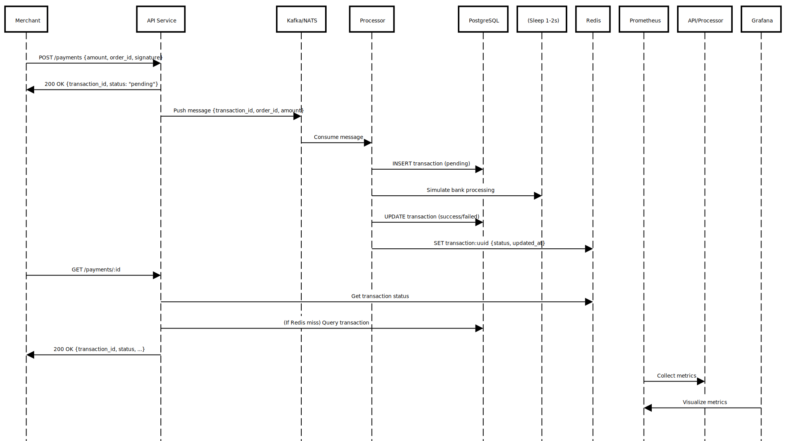

# Payment Gateway Simulator (GoFiber + sqlx)

A small, production-like payment gateway.

## Stack
- Go 1.22, GoFiber
- sqlx + PostgreSQL
- Redis
- NATS (pub/sub)
- Prometheus + Grafana
- Docker Compose

## Diagram





## Structure
```
payment-gateway-simulator/
├── cmd/
│   ├── api/          # API Service (GoFiber)
│   │   └── main.go
│   └── processor/    # Processor Service (NATS consumer)
│       └── main.go
├── internal/
│   ├── config/       # Load env
│   ├── db/           # sqlx connect
│   ├── cache/        # Redis client
│   ├── queue/        # NATS connect
│   └── payment/      # model + repository + service
├── deployments/postgres/init.sql
├── docker-compose.yml
├── prometheus.yml
├── .env.example
└── README.md 

```
## Run
```bash
cp .env.example .env   
docker compose up --build -d
```

## Demo
1. Create a signature: `message = orderID|amount` (e.g., `ORD123|100.00`) HMAC-SHA256 with `HMAC_SECRET`.
2. Create payment:
```bash
curl -X POST http://localhost:3000/payments   -H 'Content-Type: application/json'   -d '{"order_id":"ORD123","amount":100.00,"signature":"<hex-signature>"}'
```
3. Poll status:
```bash
curl http://localhost:3000/payments/<id>
```
4. Metrics: Prometheus at http://localhost:9090, Grafana at http://localhost:3001 (default admin/admin).

## Notes
- 80% success, 20% fail (random) to simulate reality.
- Redis caches the latest status for 10 minutes.
- SQL schema is initialized via `deployments/postgres/init.sql`.
```

